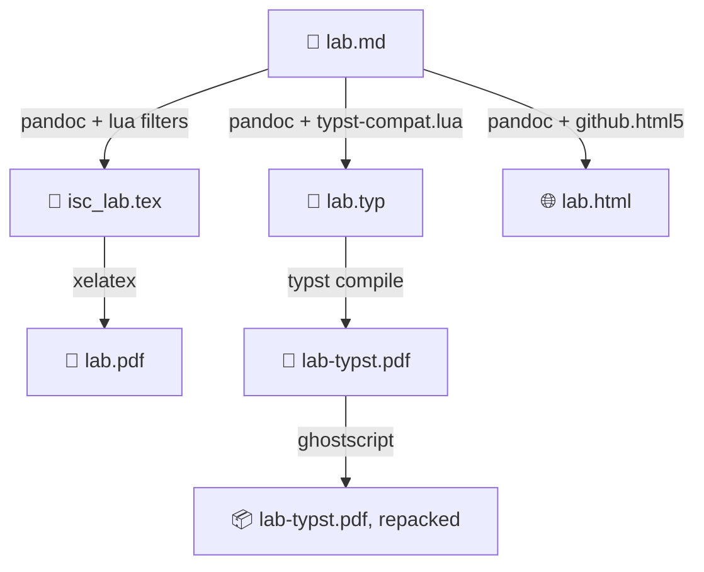

<picture>
  <source media="(prefers-color-scheme: dark)"
          srcset="https://raw.githubusercontent.com/ISC-HEI/isc-logos/main/white/ISC%20Logo%20inline%20white%20v3%20-%20large.webp">
  
</picture>

[](http://creativecommons.org/licenses/by-nc-sa/4.0/)
[](https://pandoc.org/)
[](https://www.latex-project.org/)
[](https://typst.app/)

# ISC Templates — exams, labs and series

Templates and build scripts for writing good-looking teaching documents for the [ISC curricula](https://isc.hevs.ch). Exams and exercise series are authored in LaTeX on top of Philip Hirschorn's [`exam` class](https://math.mit.edu/~psh/exam/examdoc.pdf), heavily tailored for ISC; labs are authored in GitHub-flavoured Markdown and rendered through [pandoc](https://pandoc.org/) to PDF — with [LaTeX](https://www.latex-project.org/) or, since `1.3.0`, with [Typst](https://typst.app/) — and to standalone HTML.

Have fun teaching :computer:
Pierre-André

## Preview

| Lab as PDF | Lab as HTML |
|:---:|:---:|
|  |  |

Ready-made samples live in [`./samples`](./samples): a [written exam](./samples/sample_written_exam/exam-sample.pdf) and its [solution](./samples/sample_written_exam/exam-sample-sol.pdf), a [series of exercises](./samples/sample_series/serie-sample.pdf) and its [solution](./samples/sample_series/serie-sample-sol.pdf), a lab rendered [with LaTeX](./samples/sample_lab/lab-expressions.pdf) and [with Typst](./samples/sample_lab/lab-expressions-typst.pdf), and a lab [as HTML](./samples/sample_lab_html/html/lab-fp.html).

## Features

- **Exams that count themselves** — the point total, the scale and the solution document are all derived from the same `.tex` source
- **Labs in Markdown** — GFM in, PDF out, with YAML front-matter variables forwarded to the template for titles, authors and course metadata
- **Two renderers, one source** — the very same `.md` feeds `xelatex` and Typst, so you can switch engine with a single flag
- **Typst preview renderer** — 0.8 s per lab against 4.9 s with `xelatex`, and error messages you can actually read
- **Standalone HTML output** — a single self-contained file, KaTeX included, several themes available
- **Batch builds** — `build_all.sh` walks every lab directory and uses GNU `parallel` when it is installed

## Quick Start

```bash
# Exams and series: run the build script next to the .tex source.
# It produces both the student hand-in and the solution.
cd samples/sample_written_exam && ./build.sh

# Labs: run the toolchain from the directory holding your Markdown file
~/build_tool/build_pandoc.sh -n lab-expressions.md

# With no file given, the first .md of the directory is compiled
~/build_tool/build_pandoc.sh

# Same lab, rendered with Typst instead of LaTeX
~/build_tool/build_pandoc.sh --typst

# Every lab directory at once, in parallel
~/build_tool/build_all.sh
```

Clone the repository anywhere in your filesystem; the examples above assume the toolchain ended up in `~/build_tool/`.

## Toolchain 1 — exams and series (LaTeX)

Not really a toolchain, rather a set of LaTeX files and scripts building on the `exam` class. The general look-and-feel has been tailored for the ISC programme, and a number of things have been adapted to the context of computer science. The shared template files live in [`./texcommon`](./texcommon).

The only prerequisite is a reasonably recent LaTeX installation and a Linux box for the build script. Compiling the samples elsewhere works, but you are on your own.

Two samples are provided: one exam and one series of exercises, each a `xxx-sample.tex` compiled by the `build.sh` sitting next to it. The script produces both the solution and the hand-in document.

> The logo files are duplicated across the two toolchains. Yes, it is ugly. It is intended.

## Toolchain 2 — labs (Markdown → PDF / HTML)

Because exams and exercises are built out of categorised questions (MCQs, true/false, long questions), they need a granularity that only LaTeX gives. Labs have no such need — no solution to hand in, no points to count — so they are described in Markdown and converted by `pandoc`. Previewing and editing stay straightforward, and the result is still a proper ISC document.

The `md` → `pdf` conversion uses a LaTeX template derived from [Wandmalfarbe's](https://github.com/Wandmalfarbe/pandoc-latex-template); HTML goes through `github.html5`, itself picked over [easy-pandoc-templates](https://github.com/ryangrose/easy-pandoc-templates) after some experimenting with its side TOC.

1. **`pandoc`** — parses the GFM source and applies the Lua filters in [`./build_tool/lua_filters`](./build_tool/lua_filters) (callouts, metadata variables, colours, TODO replacement)
2. **Template** — `isc_lab.tex` or `isc_lab.typ` receives the YAML front-matter variables and lays the document out
3. **Engine** — `xelatex` (default), `typst`, or neither for the HTML path
4. **`ghostscript`** — repacks the Typst PDF when available, and is skipped when it is not



The script options are `-i FILE` (input), `-n DIR` (working directory), `-o DEST` (copy the PDF somewhere), `-t` (oral exam template), `-e ENGINE` (LaTeX engine), `--typst` / `-y` (hand over to Typst). Anything else is forwarded to `pandoc` untouched. Without `-e`, `xelatex` is used when available, otherwise the first of `lualatex` / `pdflatex` found on the system.

## Typst output (preview)

Since version `1.3.0`, labs can also be rendered with Typst instead of LaTeX. **This is a preview feature**: the LaTeX template remains the reference and is not going anywhere.

```bash
~/build_tool/build_pandoc.sh --typst      # -y works too
~/build_tool/build_typst.sh               # same thing, called directly
~/build_tool/build_all.sh --typst         # the whole batch
```

Typst does *not* produce smaller files: it embeds a full subset per font, so its PDF comes out about three times heavier than the LaTeX one. If `ghostscript` is installed, the build repacks the file and brings it back in line (290 kB down to 100 kB on the sample); if it is not, the step is skipped and the PDF is simply bigger. `--no-compress` turns it off.

An intermediate `.typ` file is written next to the Markdown and kept on purpose: it is what you need to debug a layout problem, and `typst compile --watch lab.typ` gives a sub-second edit loop. Add `*.typ` to your `.gitignore`, or pass `-c` to `build_typst.sh` to have it removed.

### Checking against the LaTeX reference

The whole point being visual parity, there is a tool for it:

```bash
~/build_tool/compareEngines.sh lab-expressions.md
```

It renders the same source with both engines and writes one PNG per page, LaTeX on the left and Typst on the right, along with the two page counts. Spacing differences are invisible in the sources: you have to look at the pages.

### What is ported, and what is not

Ported, in [`./build_tool/typst/isc_lab.typ`](./build_tool/typst/isc_lab.typ): page geometry, fonts, headers and footers, headings with their rules, framed listings with line numbers, booktabs tables, captions, block quotes and the callout boxes (`::: info`, `::: warning`, `::: checkout`, closed by a bare `:::`, with the default title replaceable through `::: {.warning title="..."}`). The sample lab uses all three. The spacing is calibrated against the LaTeX output, measured rather than eyeballed.

Not ported: the oral exam template, and toolchain 1 for exams and series, which does not go through `pandoc` at all.

Known differences:

- A `\newpage` at the end of a list item is dropped, Typst forbidding a page break inside a container. One at the end of a paragraph works fine.
- Syntax highlighting uses Typst's own engine, so token colours are close to, but not identical to, the `lstlisting` palette.
- A level-2 heading placed directly under a level-1 one gets slightly more air than in LaTeX, which collapses the spacing of consecutive titles.

Raw LaTeX in the Markdown is translated where an equivalent exists (`\newpage`, `\vspace`, `\label`, `\ref`); anything else is dropped, so do check the result if your source leans on LaTeX commands.

## HTML output

HTML goes through `pandoc` as well, and the output is a single self-contained file. Several themes are embedded in [`./build_tool/html_templates`](./build_tool/html_templates); the results are not perfect yet, but they work. Go to [`./samples/sample_lab_html`](./samples/sample_lab_html) and run the `.sh` files to see for yourself.

For continuous rebuilds while writing, `build_html_continuous.sh` relies on `filewatcher`:

```bash
gem install filewatcher filewatcher-cli
./build_html.sh
```

## Keeping the PDF small

Screenshots are what make a lab heavy, and they are worth quantizing before anything else. From the `figs` directory of your lab:

```bash
pngquant --quality 50-80 *.png --ext .png --force
```

Careful, this rewrites the files in place, so commit them first or work on a copy. On a set of 16 real lab screenshots the gain was 68% (7.9 MB down to 2.5 MB), for a loss invisible at the size a figure is printed. This is why the build scripts do not do it for you: it touches your sources, not the output.

## Dependencies

The toolchain is tested on Debian-based distributions (Ubuntu on WSL2, native Debian) and on macOS. The table below lists every binary the build scripts call. MacPorts works just as well as Homebrew — `port install <pkg>` for the same package names.

| Tool | Required for | Linux (Debian/Ubuntu) | macOS (Homebrew) |
| --- | --- | --- | --- |
| **pandoc** | Markdown → PDF and HTML | [GitHub release](https://github.com/jgm/pandoc/releases) `.deb` (do *not* use `apt`, its packages are outdated) | `brew install pandoc` |
| **TeX Live** | every LaTeX document, exams included | `apt install texlive-full` | `port install texlive-latex texlive-latex-extra` |
| **librsvg** | SVG figures and logos | `apt install librsvg2-bin` | `brew install librsvg` |
| **GNU parallel** | batch builds with `build_all.sh` | `apt install parallel` | `brew install parallel` |
| **rename** | batch builds | `apt install rename` | `brew install rename` |
| **typst** | the Typst preview renderer | [GitHub release](https://github.com/typst/typst/releases), or `cargo install --locked typst-cli` | `brew install typst` |
| **ghostscript** | optional — repacking the Typst PDF | `apt install ghostscript` | `brew install ghostscript` |
| **pngquant** | optional — quantizing figures | `apt install pngquant` | `brew install pngquant` |
| **poppler-utils** | `compareEngines.sh` (`pdftoppm`) | `apt install poppler-utils` | `brew install poppler` |
| **filewatcher** | optional — continuous HTML rebuilds | `gem install filewatcher filewatcher-cli` | `gem install filewatcher filewatcher-cli` |

## Roadmap

Unifying the two toolchains behind a Markdown extension able to categorise questions and answers is the plan, so that exams and series stop needing hand-written LaTeX. This remains work-in-progress — contributions welcome. Oral exams have a template but no sample yet.

If you need help installing or running the tools, get in touch with the maintainer, open an issue, or send a PR.

---

## License

Copyright © 2023–2026 P.-A. Mudry / ISC — HES-SO Valais. This work is licensed under a [Creative Commons Attribution-NonCommercial-ShareAlike 4.0 International License](http://creativecommons.org/licenses/by-nc-sa/4.0/).

You are free to share and adapt the material for non-commercial purposes, as long as you give appropriate credit and distribute your contributions under the same licence.

---

*Made with ♥ by mui, 2026*
