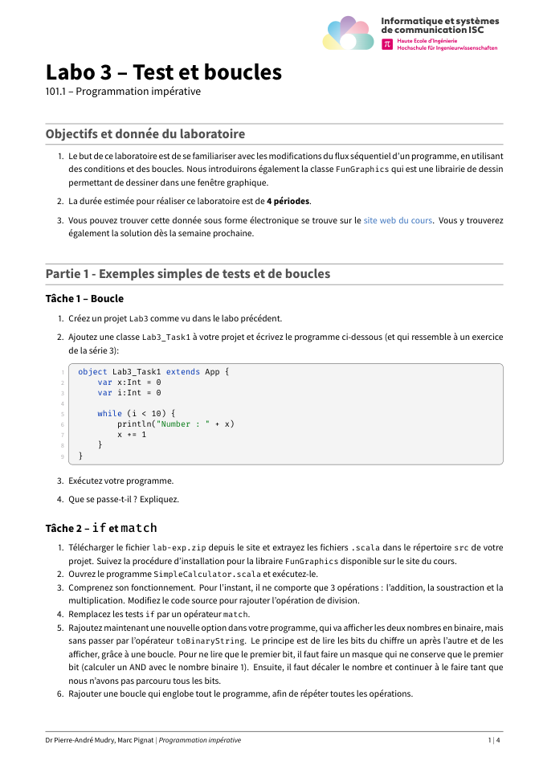
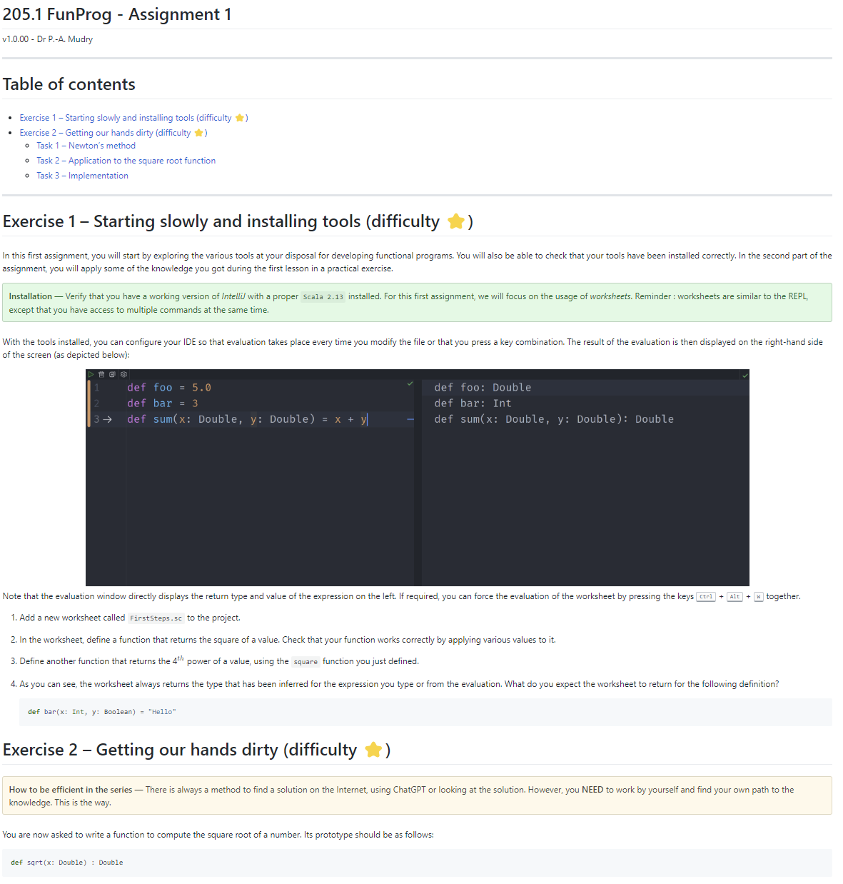

[![CC BY-NC-SA 4.0][cc-by-nc-sa-shield]][cc-by-nc-sa]

This work is licensed under a
[Creative Commons Attribution-NonCommercial-ShareAlike 4.0 International License][cc-by-nc-sa].

[cc-by-nc-sa]: http://creativecommons.org/licenses/by-nc-sa/4.0/
[cc-by-nc-sa-image]: https://licensebuttons.net/l/by-nc-sa/4.0/88x31.png
[cc-by-nc-sa-shield]: https://img.shields.io/badge/License-CC%20BY--NC--SA%204.0-lightgrey.svg

# ISC Templates for exams, labs and series
Do you want to write good-looking documents for your exams, exercise sets and labs for the [ISC curricula](https://isc.hevs.ch), but find it too time-consuming to produce consistent results? Then this repository is for you!

Here you'll find tools for writing : 
- [written exams](samples/sample_written_exam/exam-sample.pdf) (and their [solutions](samples/sample_written_exam/exam-sample-sol.pdf))
- [series of exercises](samples/sample_series/serie-sample.pdf) (with their [solutions too](samples/sample_series/serie-sample.pdf))
- [laboratories as PDF files](samples/sample_lab/lab-expressions.pdf) or as [HTML files](samples/sample_lab_html/html/lab-fp.html), the PDF being rendered either with LaTeX or, as a [preview feature](#typst-output-preview), [with Typst](samples/sample_lab/lab-expressions-typst.pdf)
- oral exams (not included in this repo, yet)

# Preamble
Unfortunately, for the moment, two different sets of tools are used to build the different types of documents. 

Because exams and exercises are based on different categories of questions (MCQs, true/false, long questions, etc.), describing those documents requires a certain amount of granularity for automatic management. This flexibility is achieved with the help of regular LaTex documents along with a set of tools that are used to automatically compute the number of points in an exam for the scale, to produce the solution in the same document, etc.

For laboratories and oral exams, on the other hand, the granularity is less fine (and there is no solution for students to give in a written document). It is therefore possible to simplify the writing process by describing the content in Markdown format. PDF documents are generated automatically from this simple and effective description using the `pandoc` toolchain. As a result, previewing and working with the documents is straightforward, simple and with beautiful results.

In the future, there are plans to unify the two toolchains by offering a Markdown extension to categorize questions and answers, but for the moment this remains a work-in-progress (but feel free to contribute if you are interested !)

Have fun teaching :computer:
Pierre-André

---

# Toolchain 1 : LaTex toolchain for exams and series

This is not really a toolchain but a set of LaTex files and scripts for building nice series and exams, based on the `exam` class made by Philip Hirschorn (https://math.mit.edu/~psh/exam/examdoc.pdf). The general look-and-feel has been heavily tailored for the ISC programme and several things have been customized or adapted for the context of computer science. 

## Installing
The single prerequisite for using this toolchain is having a decently recent installation of LaTex accessible in your system as well a Linux for using the build script. If you don't like Linux or don't want to use it, it is of course possible to compile the samples but you are on your own. 

> _What is used ?_
>
> The template file used for compiling the LaTex samples is located in the `texcommon`. 
> Yes, I know, the logo files are replicated twice (once for each toolchain) and this is ugly. This is intended, even if it's a bit sad. Deal with it.

## Samples
There are two sample example : one for an exam and a second for a series of exercises (see `xxx-sample.tex` that can be compiled with the corresponding `build.sh` script). The script builds both the solution and the hand-in document for the students. Have a look in the `samples` directories to see the results for the different document types.

---
# Toolchain 2 : `pandoc` for converting GFM markdown to PDF and/or HTML, for ISC labs
This toolchain uses [pandoc](https://pandoc.org/) for writing labs in Markdown (in its `gfm` flavour). 

The heavy lifting for converting `markdown` to `pdf` is made using `pandoc` with a LaTex template based [on the Wandmalfarbe](https://github.com/Wandmalfarbe/pandoc-latex-template) solution. The conversion to HTML is made with the same tools and `easy-pandoc-templates` from https://github.com/ryangrose/easy-pandoc-templates which has a nice TOC on the side but I finally chose to use `Github.html5` instead.

The conversion is rather fast and can be made in batch. The advantage of this solution resides in 
- writing Markdown is much faster and easier than plain Tex
- its speed for converting `md` to `pdf`
- the fact that variables can be defined at the beginning of the `md` module file using YAML. The variables are then passed to Latex and can be used in the template for further processing.
- the output is PDF, with the (not yet implemented) possibility to create the corresponding HTML output.

## Sample output


## Repository content
This repository contains a set of script files (in `build_tool`), the corresponding LaTex template for the lab as well as some examples (in the `samples` directory).

## Installing
The toolchain has been tested on Debian based distros (Ubuntu on WSL2, native Debian) and on MacOS. It has some dependencies on native tools as explained below.

### General Linux dependencies (for Debian based distros)
Quick install (but not minimal):

```bash
apt install parallel rename librsvg2-bin
apt install texlive-full
```

### General macOS dependencies
Installation using [MacPorts](https://www.macports.org) (not minimal):

```bash
port install librsvg
port install texlive-latex texlive-latex-extra
```
---  

### Installing Pandoc 
Please install `pandoc` latest version from here `https://github.com/jgm/pandoc/releases/tag/3.1.2` or newer, following the instructions. Please do not use `apt` for installing `pandoc` as the packages are largely outdated (at least for older Ubuntu distributions).

On macOS, you may install `pandoc` using MacPorts:

```bash
port install pandoc
```

### Installing Typst (optional)
Only needed for the preview renderer described below. Grab a binary from the
[releases page](https://github.com/typst/typst/releases), or use a package
manager:

```bash
brew install typst                    # macOS
cargo install --locked typst-cli      # anywhere Rust is available
```

Ghostscript is optional too, and used to shrink the generated PDF (see below).
Without it the build simply skips that step.

```bash
apt install ghostscript pngquant      # Debian based
port install ghostscript pngquant     # macOS
```

## Compiling a lab with the toolchain
Clone this repository somewhere in your filesystem. Let's consider that the toolchain is installed in `~/build_tool/`. 

In order to build the PDF from the `samples/sample_lab/lab-expressions.md` file, run from the location the `md` you want to compile is located :

```bash
~/build_tool/build_pandoc.sh -n lab-expressions.md
```

If no file is specified, the first `md` file is compiled 

```bash 
~/build_tool/build_pandoc.sh
```

### Continuous compilation
It is also possible to run compilation every time the source file is changed by using the `build_continuous.sh` script.

### Keeping the PDF small
Screenshots are what make a lab heavy, and they are worth quantizing before
anything else. From the `figs` directory of your lab:

```bash
pngquant --quality 50-80 *.png --ext .png --force
```

Careful, this rewrites the files in place, so commit them first or work on a
copy. On a set of 16 real lab screenshots the gain was 68% (7.9 MB down to
2.5 MB), for a loss invisible at the size a figure is printed. This is why the
build scripts do not do it for you: it touches your sources, not the output.

The generated PDF itself is repacked with `ghostscript` on the Typst path, see
below.

## Typst output (preview)
Since version `1.3.0`, labs can also be rendered with [Typst](https://typst.app)
instead of LaTeX. **This is a preview feature**: the LaTeX template remains the
reference and is not going anywhere.

Why bother? Speed, mostly: the sample lab takes 0.8 s to render with Typst
against 4.9 s with `xelatex`, and the error messages are readable. The source
does not change, the very same `.md` feeds both engines — compare
[the LaTeX output](samples/sample_lab/lab-expressions.pdf) with
[the Typst one](samples/sample_lab/lab-expressions-typst.pdf).

Typst does *not* produce smaller files: it embeds a full subset per font, so
its PDF comes out about three times heavier than the LaTeX one. If
`ghostscript` is installed, the build repacks the file and brings it back in
line (290 kB down to 100 kB on the sample); if it is not, the step is skipped
and the PDF is simply bigger. `--no-compress` turns it off.

```bash
~/build_tool/build_pandoc.sh --typst      # -y works too
~/build_tool/build_typst.sh               # same thing, called directly
```

`build_all.sh --typst` does the whole batch. The other options are those of the
LaTeX path (`-i`, `-n`, `-o`).

An intermediate `.typ` file is written next to the Markdown and kept on
purpose: it is what you need to debug a layout problem, and
`typst compile --watch lab.typ` gives a sub-second edit loop. Add `*.typ` to
your `.gitignore`, or pass `-c` to `build_typst.sh` to have it removed.

### Checking against the LaTeX reference
The whole point being visual parity, there is a tool for it:

```bash
~/build_tool/compareEngines.sh lab-expressions.md
```

It renders the same source with both engines and writes one PNG per page, LaTeX
on the left and Typst on the right, along with the two page counts. Spacing
differences are invisible in the sources: you have to look at the pages.

### What is ported, and what is not
Ported, in `build_tool/typst/isc_lab.typ`: page geometry, fonts, headers and
footers, headings with their rules, framed listings with line numbers, booktabs
tables, captions, block quotes and the callout boxes (`::: info`,
`::: warning`, `::: checkout`, closed by a bare `:::`, with the default title
replaceable through `::: {.warning title="..."}`). The sample lab uses all
three. The spacing is
calibrated against the LaTeX output, measured rather than eyeballed.

Not ported: the oral exam template, and toolchain 1 for exams and series, which
does not go through `pandoc` at all.

Known differences:

- A `\newpage` at the end of a list item is dropped, Typst forbidding a page
  break inside a container. One at the end of a paragraph works fine.
- Syntax highlighting uses Typst's own engine, so token colours are close to,
  but not identical to, the `lstlisting` palette.
- A level-2 heading placed directly under a level-1 one gets slightly more air
  than in LaTeX, which collapses the spacing of consecutive titles.

Raw LaTeX in the Markdown is translated where an equivalent exists (`\newpage`,
`\vspace`, `\label`, `\ref`); anything else is dropped, so do check the result
if your source leans on LaTeX commands.

## Compiling with HTML output
For HTML output, `pandoc` is used as well. Different themes are provided and even though the results are not perfect so far, it works. To see how it works, go to `samples/sample_lab_html` and run the corresponding `.sh` files. The output looks like this : 



For continuous update during development, I use (even if not really required but so comfy to use) 

```bash
gem install filewatcher
gem install filewatcher-cli
```

and then

```bash
./build_html.sh
```

The output is very nice as it is a single HTML file ! The different templates are embedded in the `build_tool` directory.

# Questions and help
If you need any help for installing or running those tools, do not hesitate to get in touch with its maintainer. 

You can of course also propose changes using PR or raise issues if something is not clear. Have fun teaching !
