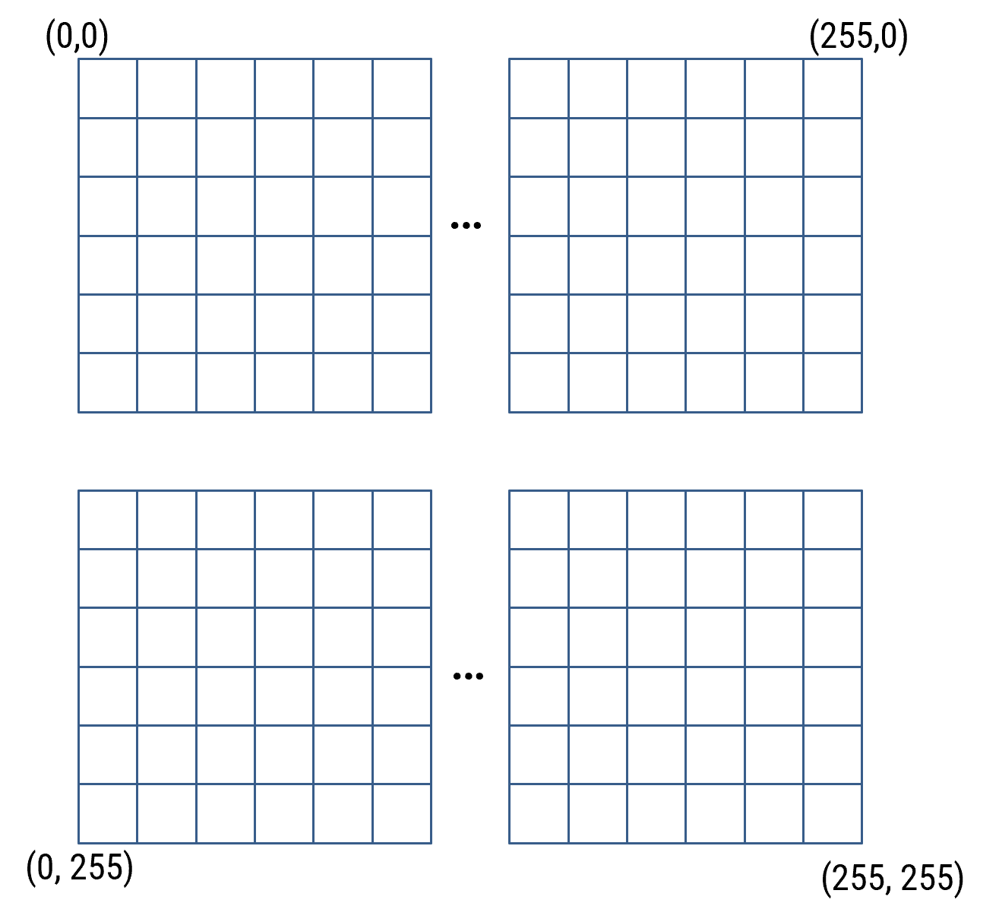
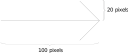
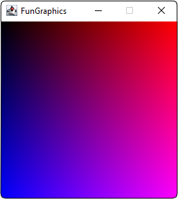
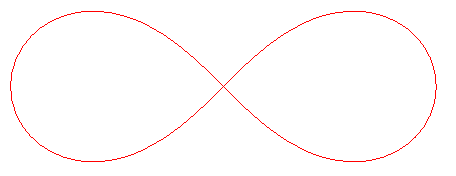

<!--
Some comments for you that read this document:
    - The header defines the generic content of the document        
    - You can include either SVG, PNG, PDF images... as you wish
    - Code can be included using gfm syntax (in the example here, using Scala). Other languages can be added if required, do not hesitate to contact me.
    - LaTex can be included directly in the markdown if required (see example below)
-->


<style>
r { color: Red }
y { color: Yellow }
FIXME { color: Yellow }
TODO {color: Blue}
</style>

# Objectifs et donnée du laboratoire

1. Le but de ce laboratoire est de se familiariser avec les modifications du flux séquentiel d'un programme, en utilisant des conditions et des boucles. 
Nous introduirons également la classe `FunGraphics` qui est une librairie de dessin permettant de dessiner dans une fenêtre graphique.

1. La durée estimée pour réaliser ce laboratoire est de **4 périodes**.

1. Vous pouvez trouver cette donnée sous forme électronique se trouve sur le [site web du cours](https://isc.hevs.ch/learn). Vous y trouverez également la solution dès la semaine prochaine.

# Partie 1 - Exemples simples de tests et de boucles

## Tâche 1 -- Boucle
1. Créez un projet `Lab3` comme vu dans le labo précédent.
1. Ajoutez une classe `Lab3_Task1` à votre projet et écrivez le programme ci-dessous (et qui ressemble à un exercice de la série 3):

    ```scala
    object Lab3_Task1 extends App {
        var x:Int = 0
        var i:Int = 0

        while (i < 10) {
            println("Number : " + x)
            x += 1
        }
    }
    ```

1. Exécutez votre programme.
1. Que se passe-t-il ? Expliquez.

## Tâche 2 -- `if` et `match`

1. Télécharger le fichier `lab-exp.zip` depuis le site et extrayez les fichiers `.scala` dans le répertoire `src` de votre projet. Suivez la procédure d'installation pour la libraire `FunGraphics` disponible sur le site du cours.
1. Ouvrez le programme `SimpleCalculator.scala` et exécutez-le.
1. Comprenez son fonctionnement. Pour l'instant, il ne comporte que 3 opérations : l'addition, la soustraction et la multiplication. Modifiez le code source pour rajouter l'opération de division.
1. Remplacez les tests `if` par un opérateur `match`.
1. Rajoutez maintenant une nouvelle option dans votre programme, qui va afficher les deux nombres en binaire, mais sans passer par l'opérateur `toBinaryString`. Le principe est de lire les bits du chiffre un après l'autre et de les afficher, grâce à une boucle. Pour ne lire que le premier bit, il faut faire un masque qui ne conserve que le premier bit (calculer un AND avec le nombre binaire 1). Ensuite, il faut décaler le nombre et continuer à le faire tant que nous n'avons pas parcouru tous les bits.
1. Rajouter une boucle qui englobe tout le programme, afin de répéter toutes les opérations.
1. Rajouter maintenant une condition qui permette de sortir de la boucle quand on le désire. Pour cela, rajoutez un nouvel opérateur dans la liste des opérateurs, nommé _quit_ et qui, lorsqu'il est sélectionné, quitte la boucle. Pour ce faire, réfléchissez à comment influencer la condition de la boucle.

# Partie 2 - Exemples simples utilisant la classe FunGraphics
La classe `FunGraphics` se charge de vous fournir une surface graphique sur laquelle vous pouvez dessiner librement. Après avoir installé la librairie comme indiqué au début de ce labo, testez maintenant l'ouverture d'une fenêtre de taille _width x height_ se réalise à l'aide du code suivant:

```scala
val display: FunGraphics = FunGraphics(width, height)
```

La librairie graphique permet contient plusieurs méthodes de dessin différentes mais nous allons commencer simplement à l'aide de la méthode `display.setPixel(x:Int, y:Int)` qui fait apparaître un point à la position (x, y). Attention, la position (0,0) se trouve en haut à gauche de l'écran comme indiqué sur la figure \ref{fig_coords}.

{height=5cm}

> Lorsque vous ajoutez une variable de type `FunGraphics`, _IntelliJ_ va rajouter automatiquement la ligne `import hevs.graphics.FunGraphics`, qui indique que nous utilisons quelque chose  provenant d'un autre ficher.

## Tâche 3 -- Dessin d'une flèche

1. Ouvrez le fichier `DrawArrow.scala` et exécutez le programme. Il va créer une fenêtre graphique et dessiner un carré noir composé de 9 pixels centré en position [150,100].
1. Codez maintenant un programme qui va dessiner une flèche horizontale qui pointe à droite, avec une longueur de 100 pixels et une tête de 20 pixels, comme dans le dessin de la figure \ref{fig_arrow}. Il vous faudra utiliser plusieurs boucles et utiliser la méthode `setPixel()`.

    1. Dessinez d'abord le trait horizontal du corps de la flèche avec une boucle.
    1. Dans un deuxième temps, dessinez chaque branche de la flèche à l'aide d'une boucle.

    {height=2.5cm}

## Tâche 4 -- Dessin d'un rectangle

Nous allons maintenant travailler un peu avec de la couleur. Pour ce faire, rajoutez la ligne `import java.awt.Color` au dessus du début de votre programme.

1. Créez une nouvelle classe `Task4` basée sur le modèle ci-dessus avec une fenêtre graphique
1. Écrivez maintenant un code qui va dessiner un rectangle plein, bleu, centré en position [200,200], d'une largeur de 300 pixels et d'une hauteur de 200 pixels. 

    > L'idée pour dessiner le rectangle est d'utiliser deux boucles imbriquées qui vont balayer les pixels correspondants au rectangle et qui vont les peindre avec la bonne couleur.

1. Pour peindre le pixel en position [x,y] en bleu, vous pouvez utiliser la méthode suivante :

    ```scala
    display.setPixel(x, y, Color.blue)
    ```

## Tâche 5 -- Dégradé rouge-bleu

1. Faites une nouvelle classe avec une interface graphique.
1. La fenêtre graphique créée doit faire 256 pixels par 256 pixels.
1. Le but de cet exercice est de dessiner une palette d'un dégradé de couleurs bleu et rouge, comme sur la figure \ref{fig_color}. Pour ce faire, il faut utiliser une première boucle pour faire le dégradé horizontal de rouge et une seconde, imbriquée dans la première, pour faire le dégradé vertical.
1. Si un pixel est à la position [x,y], on va le peindre avec une valeur de bleu de `y` et une valeur de rouge de `x`. La valeur verte du pixel restant toujours à zéro.
1. Pour peindre le pixel en position [x,y] d'une certaine couleur, on utilise ainsi:

    ```scala
    display.setPixel(x, y, new Color(RED, GREEN, BLUE))
    ```

    > Dans une couleur dans ce modèle, on décrit la couleur finale en fonction des composantes RED, GREEN et BLUE. Dans notre cas, ce sont des valeurs entières entre 0 et 255. La valeur 0 signifie qu'une composante de la couleur est absente, tandis que 255 signifie que la couleur est à son intensité maximale. On peut en mélangeant ces couleurs de bases réaliser toutes sortes de couleurs. 

    {height=5.0cm}
1. Combien de couleurs **différentes** peut-on obtenir avec le système décrit ci-dessus ?

## Tâche 6 -- Dessin d'un disque

1. Écrivez maintenant un code qui va créer une fenêtre graphique et y dessiner un disque bleu rempli, centré en position [200,200] et d'un rayon de 100 pixels, sur fond rouge.
1. Une possibilité pour résoudre ce problème et de créer deux boucles qui vont balayer tous les pixels de l'image, les peindre en bleu s'ils sont dans le disque (remplissent la condition de distance par rapport au centre du cercle) et en rouge sinon.

## Tâche 7 -- Lemniscate

Le lemniscate de Bernoulli est une courbe mathématique dont le tracé est le suivant :

{height=3.0cm}

1. Dessinez cette courbe dans laquelle les coordonnées `x` et `y` qui se trouvent sur la courbe sont donnés par l'équation paramétrique suivante (_a_ est une constante) :
    $$ \left\{\begin{matrix}
    x(t)=a \frac{\sin t}{1 + \cos^{2} t} \\
    y(t)=a \frac{\sin t \cos t}{1 + \cos^{2} t} \\
    \end{matrix}\right.
    $$

1. Quel est l'effet de $a$ dans le jeu d'équation ci-dessus ?

1. **[Optionnel]** Affichez le dessin de manière animée afin de voir la variation de `t` avec le temps.